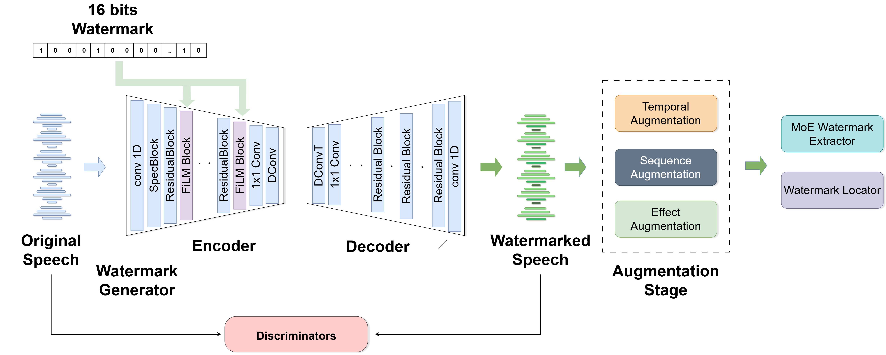

# WaveVerify: A Novel Audio Watermarking Framework for Media Authentication and Combatting Deepfakes

[](https://ieee-biometrics.org/ijcb2025/)
[](https://opensource.org/licenses/MIT)
[](https://www.python.org/downloads/release/python-380/)

Official PyTorch implementation for **"WaveVerify: A Novel Audio Watermarking Framework for Media Authentication and Combatting Deepfakes"**, accepted at the IEEE International Joint Conference on Biometrics (IJCB) 2025.

**Authors:** Aditya Pujari and Ajita Rattani  
*University of North Texas*

---

## Abstract

> With the rise of voice synthesis technology threatening digital media integrity, audio watermarking has become a crucial defense for content authentication. Despite advances, current solutions struggle with robustness against audio effects such as high-pass filtering and temporal modifications, and often suffer from poor watermark localization. We introduce **WaveVerify**, an advanced watermarking system that overcomes these limitations through a FiLM-based generator for resilient multiband watermark embedding and a Mixture-of-Experts detector for accurate extraction and localization. Our unified training framework enhances robustness by dynamically applying multiple distortions in a single backpropagation step through a dynamic effect scheduler, ensuring consistent performance across diverse audio environments. Evaluations across multiple datasets show that WaveVerify outperforms state-of-the-art models such as AudioSeal and WavMark, achieving zero Bit Error Rate (BER) under common distortions and Mean Intersection over Union (MIoU) scores of 0.98 or higher even under severe temporal modifications. Additionally, our FiLM-based generator architecture eliminates computational bottlenecks through parallel hierarchical modulation, reducing training time by approximately 80% compared to sequential bottleneck-based watermark embedding approaches while maintaining high performance. These results establish WaveVerify as a robust, efficient, and practical solution for real-world audio watermarking.

---

## Architecture Overview

WaveVerify introduces a novel end-to-end approach for robust audio watermarking, integrating three synergistic components within a unified Audio Watermarking architecture.

<p align="center">
  
  <br>
  <em>The end-to-end training pipeline of WaveVerify, where a FiLM-based generator embeds bits into speech, followed by temporal -> sequence -> effect augmentations, and extraction via a locator and detector.</em>
</p>

At its core, the framework consists of:

- **Generator**: Employs an encoder-decoder architecture with Feature-wise Linear Modulation (FiLM) for watermark embedding, enabling parallel hierarchical modulation
- **Locator**: Enables precise sample-level identification of watermarked regions while maintaining minimal computational overhead (~0.13M parameters)
- **Detector**: Utilizes a sophisticated specialized expert network (~4.5M parameters)

---

## Performance Highlights

- **Zero Bit Error Rate (BER)** under common audio distortions
- **Mean Intersection over Union (MIoU) ≥ 0.98** even under severe temporal modifications
- **80% reduction in training time** compared to sequential bottleneck-based approaches
- **Robust against temporal attacks** including reversal, circular shifting, and segment shuffling
- **Superior performance under high-pass filtering** and combined audio effects

---

## Dataset Setup

### Supported Datasets

- [LibriSpeech](https://www.openslr.org/12) - 1,000 hours of read English speech
- [Common Voice](https://commonvoice.mozilla.org/) - 200 hours spanning 10 languages
- [CMU Arctic](http://www.festvox.org/cmu_arctic/) - 20 hours of professional speech
- [DIPCO](https://zenodo.org/records/8122551) - 40 hours of conversational speech

### Directory Structure

Organize your datasets according to the following structure:

```
AudioDataset/
├── LibriSpeech/
│   ├── train/
│   ├── valid/
│   └── test/
├── CommonVoice/
│   ├── train/
│   ├── valid/
│   └── test/
├── CMUArctic/
│   ├── train/
│   ├── valid/
│   └── test/
└── DIPCO/
    ├── train/
    ├── valid/
    └── test/
```

### Configuration

Update the dataset folder path in `conf/base.yml` to point to your `AudioDataset/` directory.

---

## Installation

### Prerequisites

- Python 3.8+
- PyTorch 1.9+
- CUDA-capable GPU (recommended)

### Quick Install

```bash
git clone https://github.com/vcbsl/WaveVerify.git
cd WaveVerify
pip install -e .
```

---

## Usage

### Training

To train the WaveVerify model:

```bash
export CUDA_VISIBLE_DEVICES=0
python scripts/train.py --args.load conf/base.yml --save_path checkpoints/runs/base/
```

**Note**: The training script uses `argbind` for configuration management. The `--args.load` syntax loads the specified YAML configuration file.

### Inference

WaveVerify is designed as a Python library for integrating audio watermarking into your applications. The pretrained checkpoint will be automatically downloaded on first use.

#### Basic Usage

```python
from waveverify import WaveVerify, WatermarkID

# Initialize (auto-downloads checkpoint on first use)
wv = WaveVerify()

# Create watermark identities for different use cases
creator_wm = WatermarkID.for_creator("artist_name_2024")
timestamp_wm = WatermarkID.for_timestamp()  # Current time
license_wm = WatermarkID.for_license("CC-BY-4.0")
tracking_wm = WatermarkID.for_tracking("order_12345")

# Embed watermark (watermark ID is REQUIRED)
watermarked_audio, sample_rate, watermark_id = wv.embed("input.wav", creator_wm, output_path="watermarked.wav")
print(f"Embedded: {watermark_id}")

# Detect watermark
watermark_id, confidence = wv.detect("watermarked.wav")
print(f"Detected: {watermark_id} (confidence: {confidence:.2%})")

# Verify specific watermark
is_authentic = wv.verify("watermarked.wav", creator_wm)

# Locate watermark regions
mask = wv.locate("watermarked.wav")
# mask is a numpy array showing watermark presence over time
```

#### Watermark Types

**Important**: WaveVerify embeds exactly 16 binary bits (65,536 possible values) into audio. All watermark types are automatically constrained to this limit.

WaveVerify provides specialized watermark types for common use cases:

```python
# For content creators (artists, podcasters, journalists)
artist_wm = WatermarkID.for_creator("beyonce_2024")

# For temporal tracking (when was this created?)
dated_wm = WatermarkID.for_timestamp(datetime(2024, 7, 17))

# For license/rights management
license_wm = WatermarkID.for_license("ALL-RIGHTS")

# For distribution tracking
episode_wm = WatermarkID.for_tracking("podcast_S01E05")

# Custom watermarks (when others don't fit)
custom_wm = WatermarkID.custom("1010101010101010")      # 16-bit binary
custom_wm = WatermarkID.custom(42)                      # Integer 0-65535
```

---

## Results

### Audio Quality Assessment

WaveVerify maintains high audio quality while ensuring robust watermark embedding:

| Method | PESQ | STOI | ViSQOL | SISNR |
|--------|------|------|--------|-------|
| WaveVerify | 4.34 | **1.00** | **4.76** | 24.23 |

### Robustness Against Audio Effects

Performance evaluation across common audio transformations:

| Audio Effect | Detection (TPR/FPR) | MIoU |
|--------------|---------------------|------|
| Identity | 1.000 (1.000/0.000) | 0.985 |
| Resample (8000Hz) | 1.000 (1.000/0.000) | 0.989 |
| Speed (0.8×) | 1.000 (1.000/0.000) | 0.983 |
| Highpass Filter (3500Hz) | 1.000 (1.000/0.000) | 0.984 |
| Bandpass Filter (300-4000Hz) | 1.000 (1.000/0.000) | 0.981 |

### Combined Effects Performance

Robustness against multiple simultaneous transformations:

| Combined Effects | Detection (TPR/FPR) | MIoU |
|------------------|---------------------|------|
| Highpass (3500Hz) + Noise (σ=0.001) | 1.000 (1.000/0.000) | 0.975 |
| Lowpass (2000Hz) + Speed (0.8×) | 1.000 (1.000/0.000) | 0.979 |
| Bandpass (300–4000Hz) + Resample (32000Hz) | 1.000 (1.000/0.000) | 0.981 |

---

## Project Status

- [x] Training implementation
- [x] Python package for easy integration 

---

## Citation

If you use WaveVerify in your research, please cite:

```bibtex
@inproceedings{pujari2025waveverify,
  title={WaveVerify: A Novel Audio Watermarking Framework for Media Authentication and Combatting Deepfakes},
  author={Pujari, Aditya and Rattani, Ajita},
  booktitle={IEEE International Joint Conference on Biometrics (IJCB)},
  year={2025}
}
```

---

## Contact

For questions or support, please contact the authors or open an issue on this repository.